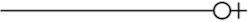
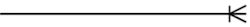
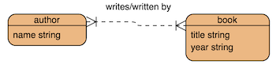

# Entity Relationship Diagrams (ERD)

 

## What are we learning?
* How to model a database design using an Entity Relationship Digram (ERD).
* Types of ERD.
* Characteristics and notation of ERD.

 

# What is an Entity Relationship Diagram (ERD)?

It is a diagram which shows the design of a database. It uses a unique *notation* to show the *entities* which exist in a data model, and the relationships between them.

 

# What is an Entity?

An **entity** represents a table of data which is concerned with a single subset of system data.

Examples of entities you may like to think about are...

* Employee
* Product
* Order
* Customer

 

An entity contains *attributes*. For instance, a Product entity may have the following attributes...

* id
* name
* description
* price

 

An attribute has a **data type**. For instance...

* id          : integer
* name        : string
* description : string
* price       : decimal

 

An entity may also have *relationships* with *other* entities. This is usually expressed as an active verb. For instance...

* 1 Order *collects* many Product(s)

...where *collects* is the active verb.

 

Where a relationship exists, the **cardinality** (number of relationships) is expressed using special notation. We will be using [Crow's Foot notation](https://medium.com/@marcifey/using-crows-foot-notation-in-an-erd-2910fff5dd05).

 

:flags: **Note**: An alternate notation called [Chen's Notation](https://www.conceptdraw.com/examples/chen-notation-tutorial) is also prolific.

 

# Crow's Foot Notation

Crow's Foot notation is a set of symbols used to express the *cardinality* (number) of relationships between entities on an ERD.

Let's take a look...

 

**1. :point_right: One**

Figure 1: Crow’s Foot Notation for One.

 

**2. :point_right: Many**

Figure 2: Crow’s Foot Notation for Many.

 

**3. :point_right: One and Only One**

Figure 3: Crow’s Foot Notation for One and Only One.

 

**4. :point_right: Zero or One**

Figure 4: Crow’s Foot Notation for Zero or One.

 

**5. :point_right: One or Many**

Figure 5: Crow’s Foot Notation for One or Many.

 

**6. :point_right: Zero or Many**

Figure 6: Crow’s Foot Notation for Zero or Many.

 

# ERD Types

The following discussion provides an overview about the different types of ERD that you are likely to encounter in the business and technical domains. It does not represent comprehensive instruction on the subject. There exists a great deal of variation between the fidelity of detail shown on each type of ERD, depending on the organisation, author and intended audience.

So, in brief...

 

There are typically *three* types of ERD...

1. :point_right: **Conceptual**: A high level view of the design. Shows the entities, attributes, relationships and cardinality between entities. Typically produced by a non-technical person during requirements gathering.

2. :point_right: **Logical**: In addition to entities, attributes, relationships and cardinality between entities, shows primary keys, foreign keys and data types. Typically produced as a first draft of the final technical specification.

3. :point_right: **Physical**: The final technical specification. In addition to the detail shown in the previous diagrams, also shows the physical implementation. For instance, the emergence of join tables. Produced by technical staff.

 

** :flags: A note about Logical ERD**

Due to the *wild* variation found in the detail shown on a Logical ERD; which is somewhere between a Conceptual and Physical ERD, we will focus on *Conceptual* and *Physical* ERD below...

 

## Conceptual ERD

Figure 7 shows a high level view of the design. From this we can see that many authors may have many books and vice versa. The active verbs *writes/written* express the two-way relationship between the entities, and the cardinality is shown as *one or many*.

Figure 7: Book and Author conceptual ERD.

A conceptual ERD is not concerned with technical or implementation details and is more easily communicated to non-technical people (business, clients, etc).

 

## Physical ERD

Figure 8 shows the final technical specification. From this we can see all of the implementation details in the design.

Figure 8: Book and Author physical ERD.

The Physical ERD includes entities, attributes, cardinality, keys, data types, as well as the emergence of the join tables required to *implement* the previous conceptual design.

 

:flags: **Note**: Relationships (active verb labels) *may or may not* be expressed on a physical ERD.

 

Your turn...

# :trophy: Challenge - XYZ Widgets ERD

1. Produce a **Physical** ERD from your [XYZ Widgets normalisation challenge](databases-and-design.md) solution.
2. Publish your ERD solution, and the normalisation challenge solution to Github.

 

*rachael.colley@coderacademy.edu.au Last updated July 28, 2018*

