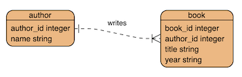
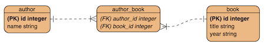
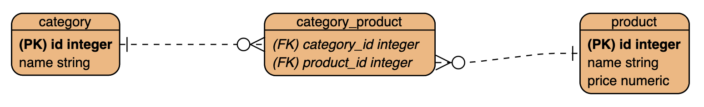

# SQL many-to-many relationships

## What are we learning

* Implementing many-to-many relationships.
* Using INNER JOIN queries

<br>

# Previously...

Previously we used [SQL to implement a Postgres database](postgres-bookstore.md) for the Bookstore database.

<br>

**The physical ERD...**

In the current design, one author has **one or many** book(s)...



Figure 1: Current Author and Book physical ERD.

<br>

# Improving the design using many-to-many

It is probably more realistic to say that *one author has one or many books* and *one book has 1 or many authors*. 

Why? Well, think about authors who have written many books - and the books who have been co-authored.

In the next step we will implement a **many-to-many** relationship between author and book.

<br>

**The new physical ERD...**

This relationship will require the use of a *join table* - in this case the join table is called *author_book*...



Figure 2: New Author and Book physical ERD.

Notice that the *author_book* join table contains foreign key references to the other entities in the relationship. Each book and author pair will have an entry in this table.

Notice that the author and book tables are linked via the **author_book** table, and no longer contain references directly to each other. This not only changes the way that the data is organised, but it will also change the way the data must be queried.

<br>

# Implementing the new design

1. Create the *author* table...

````
CREATE TABLE author (author_id SERIAL PRIMARY KEY, name varchar(255) NOT NULL);
````

<br>

2. Create *book* table...
````
CREATE TABLE book (book_id SERIAL PRIMARY KEY, title varchar(255) NOT NULL);
````

<br>

3. Create *author_book* join table...
````
CREATE TABLE author_book (author_id INTEGER REFERENCES author(author_id), book_id INTEGER REFERENCES book(book_id));
````

<br>

4. Insert book and author records...

````
INSERT INTO author (name) VALUES ('J. R. R. Tolkien');
INSERT INTO author (name) VALUES ('Marion Zimmer-Bradley');
INSERT INTO author (name) VALUES ('Dan Brown');
INSERT INTO author (name) VALUES ('Jack London');
INSERT INTO author (name) VALUES ('Paulo Coelho');
INSERT INTO author (name) VALUES ('Diana L. Paxson');

INSERT INTO book (title) VALUES ('The Lord of the Rings');
INSERT INTO book (title) VALUES ('The Mists of Avalon');
INSERT INTO book (title) VALUES ('The Firebrand');
INSERT INTO book (title) VALUES ('The Davinci Code');
INSERT INTO book (title) VALUES ('Demons and Angels');
INSERT INTO book (title) VALUES ('Call of the Wild');
INSERT INTO book (title) VALUES ('Ravens of Avalon');

````

<br>

5. Insert the *author_book* **join** table data...

````
INSERT INTO author_book (author_id, book_id) VALUES (1, 1);
INSERT INTO author_book (author_id, book_id) VALUES (2, 2);
INSERT INTO author_book (author_id, book_id) VALUES (2, 3);
INSERT INTO author_book (author_id, book_id) VALUES (3, 4);
INSERT INTO author_book (author_id, book_id) VALUES (3, 5);
INSERT INTO author_book (author_id, book_id) VALUES (4, 6);
INSERT INTO author_book (author_id, book_id) VALUES (6, 7);
INSERT INTO author_book (author_id, book_id) VALUES (2, 7);
````

<br>

6. Execute **INNER JOIN** query - Get all columns of book and book_author which have a match for author_id in the author_book table...

````SQL
SELECT * FROM book INNER JOIN author_book ON book.book_id = author_book.book_id WHERE author_book.author_id = 2;
````

...results...

````
 book_id |        title        | author_id | book_id 
---------+---------------------+-----------+---------
       2 | The Mists of Avalon |         2 |       2
       3 | The Firebrand       |         2 |       3
       7 | Ravens of Avalon    |         2 |       7
(3 rows)
````

<br>

**Let's break down this query...**

The format for an INNER JOIN is as follows...

````
SELECT column_name(s)
FROM table1
INNER JOIN table2
ON table1.column_name = table2.column_name;
````

<br>

...our INNER JOIN...

`SELECT * FROM book` ...select all columns

`INNER JOIN author_book ON book.book_id = author_book.book_id` ...join the book table on the author_book table where the book_id is equal.

`WHERE author_book.author_id = 2;` ...where the author_id is 2.

<br>


7. Next query - Get all columns where book and author records are joined...

````SQL
SELECT * FROM book INNER JOIN author_book ON book.book_id = author_book.book_id INNER JOIN author ON author_book.author_id = author.author_id; 
````

...results...

````
 book_id |         title         | author_id | book_id | author_id |         name          
---------+-----------------------+-----------+---------+-----------+-----------------------
       1 | The Lord of the Rings |         1 |       1 |         1 | J. R. R. Tolkien
       2 | The Mists of Avalon   |         2 |       2 |         2 | Marion Zimmer-Bradley
       3 | The Firebrand         |         2 |       3 |         2 | Marion Zimmer-Bradley
       4 | The Davinci Code      |         3 |       4 |         3 | Dan Brown
       5 | Demons and Angels     |         3 |       5 |         3 | Dan Brown
       6 | Call of the Wild      |         4 |       6 |         4 | Jack London
       7 | Ravens of Avalon      |         6 |       7 |         6 | Diana L. Paxson
       7 | Ravens of Avalon      |         2 |       7 |         2 | Marion Zimmer-Bradley
(8 rows)
````

<br>

**Let's break down this query...**

`SELECT * FROM book` ...select all columns from the book table.

`INNER JOIN author_book ON book.book_id = author_book.book_id` ...join 1 - join the book table on the author_book table where the book_id is equal.

`INNER JOIN author ON author_book.author_id = author.author_id;` ...join 2 - join the result of join 1 on the author table where the author id is equal.

<br>


8. Next query - Order the results by author name...

````SQL
SELECT * FROM book INNER JOIN author_book ON book.book_id = author_book.book_id INNER JOIN author ON author_book.author_id = author.author_id ORDER BY author.name; 
````

...results...

````
 book_id |         title         | author_id | book_id | author_id |         name          
---------+-----------------------+-----------+---------+-----------+-----------------------
       4 | The Davinci Code      |         3 |       4 |         3 | Dan Brown
       5 | Demons and Angels     |         3 |       5 |         3 | Dan Brown
       7 | Ravens of Avalon      |         6 |       7 |         6 | Diana L. Paxson
       1 | The Lord of the Rings |         1 |       1 |         1 | J. R. R. Tolkien
       6 | Call of the Wild      |         4 |       6 |         4 | Jack London
       3 | The Firebrand         |         2 |       3 |         2 | Marion Zimmer-Bradley
       2 | The Mists of Avalon   |         2 |       2 |         2 | Marion Zimmer-Bradley
       7 | Ravens of Avalon      |         2 |       7 |         2 | Marion Zimmer-Bradley
(8 rows)
````

<br>


9. Next query - Get all columns of books for author id 2 (Marion Zimmer Bradley)...

````SQL
SELECT * FROM book INNER JOIN author_book ON book.book_id = author_book.book_id INNER JOIN author ON author_book.author_id = author.author_id WHERE author_book.author_id = 2;
````

...results...

````
 book_id |        title        | author_id | book_id | author_id |         name          
---------+---------------------+-----------+---------+-----------+-----------------------
       2 | The Mists of Avalon |         2 |       2 |         2 | Marion Zimmer-Bradley
       3 | The Firebrand       |         2 |       3 |         2 | Marion Zimmer-Bradley
       7 | Ravens of Avalon    |         2 |       7 |         2 | Marion Zimmer-Bradley
(3 rows)
````


<br>

10. Next query - Get all columns of books and authors for author id 6 (Diana L. Paxson)...

````SQL
SELECT * FROM book INNER JOIN author_book ON book.book_id = author_book.book_id INNER JOIN author ON author_book.author_id = author.author_id WHERE author_book.author_id = 6;
````

...results...

````
 book_id |      title       | author_id | book_id | author_id |      name       
---------+------------------+-----------+---------+-----------+-----------------
       7 | Ravens of Avalon |         6 |       7 |         6 | Diana L. Paxson
(1 row)
````

<br>

11. Next query - Get book title and author name for book id 7...

````SQL
SELECT book.title, author.name FROM book INNER JOIN author_book ON book.book_id = author_book.book_id INNER JOIN author ON author_book.author_id = author.author_id WHERE author_book.book_id = 7;
````

...results...

````
      title       |         name          
------------------+-----------------------
 Ravens of Avalon | Marion Zimmer-Bradley
 Ravens of Avalon | Diana L. Paxson
(2 rows)
````


<br>

12. Next query - Get book title and author name for book id 7, using an alias to improve column name...

````SQL
SELECT book.title AS book_title, author.name AS author_name FROM book INNER JOIN author_book ON book.book_id = author_book.book_id INNER JOIN author ON author_book.author_id = author.author_id WHERE author_book.book_id = 7;
````

...results...

````
    book_title    |      author_name      
------------------+-----------------------
 Ravens of Avalon | Marion Zimmer-Bradley
 Ravens of Avalon | Diana L. Paxson
(2 rows)
````

<br>
<br>

Your turn....

<hr>

<hr>

# :trophy: Challenge: Implement this DB design

1. From the physical ERD shown in Figure 3, use SQL to create a database called category-store on your local Postgres server.

2. Insert test data into each table.

3. Write an INNER JOIN query which selects a product name and its corresponding category name.

<br>



Figure 3: Category and Store physical ERD.

<br>

<hr>

Also see [W3CSchools.com SQL INNER JOIN Keyword](https://www.w3schools.com/sql/sql_join_inner.asp)

<br>

<hr>

*rachael.colley<span></span>@coderacademy.edu.au Last updated July 1, 2018*

<hr>

